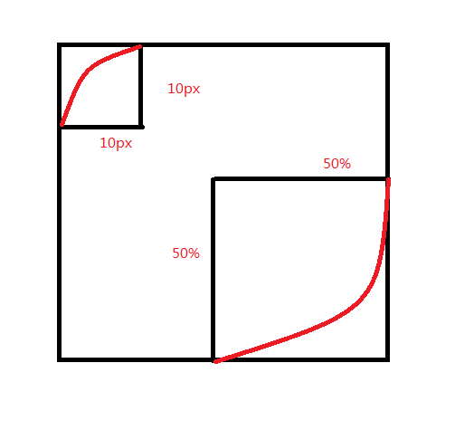

## 1.常用/目前支持文本属性

### Css1
* color 
* letter-spacing(字符间距)
* line-height
* text-align
* text-decoration(规定添加到文本的装饰效果)
* text-indent (规定文本块首行的缩进)
* text-transform(控制文本的大小写)
* white-space(规定如何处理元素中的空白)
* word-spacing(设置单词间距)

### Css2
* direction(规定文本的方向 / 书写方向)
* text-shadow(文本的阴影效果)


### Css3
* text-overflow(文本溢出包含元素时发生的事情)
  * clip    超出的部分直接截断
  * ellipsis 超出的部分用省略号表示
  * 自定义字符(只在火狐兼容。)
* text-shadow(向文本添加阴影)
* word-break(规定非中日韩文本的换行规则)
  * normal
  * keep-all
  * break-all *
* word-wrap(允许对长的不可分割的单词进行分割并换行到下一行)
  * normal
  * break-word 
  
## 2.border-radius

完整写法：

border-radius:10px 10px 20px 30px / 10px 10px 20px 30px;





## 3.box-shadow
```
/* 投影是否向内(可选，默认向外) x轴偏移量 y轴偏移量 模糊范围(可选) 扩散范围(可选) 颜色(可选) */
box-shadow: [inset] <offset-x> <offset-y> [<blur-radius> = 0] [<spread-radius> = 0] [<color>]

```
* 当给出两个、三个或四个 css长度值时
  * 如果只给出两个值, 那么这两个值将会被当作 <offset-x><offset-y> 来解释。
  * 如果给出了第三个值, 那么第三个值将会被当作<blur-radius>解释。
  * 如果给出了第四个值, 那么第四个值将会被当作<spread-radius>来解释。
* 内投影的位置：在边框之内 (即使是透明边框）、在背景之上、在内边距之上、在内容之下
* 外投影的位置：在背景之下、在外边距之上。
* 当设定多组box-shadow值，先给定的值叠在上层，后给定的值插在下层。

